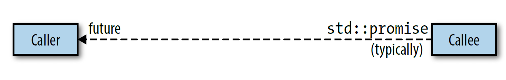
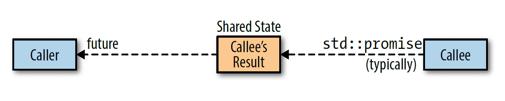

# std::future的析构行为

可合并的 [std::thread](https://en.cppreference.com/w/cpp/thread/thread) 对应一个底层系统线程，采用 [std::launch::async](https://en.cppreference.com/w/cpp/thread/launch) 启动策略的 [std::async](https://en.cppreference.com/w/cpp/thread/async) 返回的 [std::future](https://en.cppreference.com/w/cpp/thread/future) 和系统线程也有类似的关系，因此可以认为 [std::thread](https://en.cppreference.com/w/cpp/thread/thread) 和 [std::future](https://en.cppreference.com/w/cpp/thread/future) 相当于系统线程的 `handle`。

销毁 [std::future](https://en.cppreference.com/w/cpp/thread/future) 有时表现为隐式 `join`，有时表现为隐式 `detach`，有时表现为既不隐式 `join` 也不隐式 `detach`，但它不会导致程序终止。这种不同表现行为是值得需要思考的。想象 [std::future](https://en.cppreference.com/w/cpp/thread/future) 处于信道的一端，callee 将 [std::promise](https://en.cppreference.com/w/cpp/thread/promise) 对象传给 caller，caller 用一个 [std::future](https://en.cppreference.com/w/cpp/thread/future) 来读取结果：

```
std::promise<int> ps;
std::future<int> ft = ps.get_future();
```



callee 的结果存储在哪？caller 调用 [get](https://en.cppreference.com/w/cpp/thread/future/get) 之前，callee 可能已经执行完毕，因此结果不可能存储在 callee 的 [std::promise](https://en.cppreference.com/w/cpp/thread/promise) 对象中。但结果也不可能存储在 caller 的 [std::future](https://en.cppreference.com/w/cpp/thread/future) 中，因为 [std::future](https://en.cppreference.com/w/cpp/thread/future) 可以用来创建 [std::shared_future](https://en.cppreference.com/w/cpp/thread/shared_future)：

```
std::shared_future<int> sf(std::move(ft));
//@ 更简洁的写法是用std::future::share返回std::shared_future
auto sf = ft.share();
```

而 [std::shared_future](https://en.cppreference.com/w/cpp/thread/shared_future) 在原始的 [std::future](https://en.cppreference.com/w/cpp/thread/future) 析构后仍然可以复制：

```
auto sf2 = sf;
auto sf3 = sf;
```

因此结果只能存储在外部某个位置，这个位置称为 `shared state`：



shared state 通常用堆上的对象表示，但类型、接口和具体实现由标准库作者决定。shared state 决定了 [std::future](https://en.cppreference.com/w/cpp/thread/future) 的析构函数行为：

- 采用 [std::launch::async](https://en.cppreference.com/w/cpp/thread/launch) 启动策略的 [std::async](https://en.cppreference.com/w/cpp/thread/async) 返回的 [std::future ](https://en.cppreference.com/w/cpp/thread/future) 中，最后一个引用 shared state的，析构函数会保持阻塞至任务执行完成。本质上，这样一个 [std::future](https://en.cppreference.com/w/cpp/thread/future) 的析构函数是对异步运行的底层线程执行了一次隐式 `join`。
- 其他所有 [std::future](https://en.cppreference.com/w/cpp/thread/future) 的析构函数只是简单地析构对象。对底层异步运行的任务，这相当于对线程执行了一次隐式 `detach`。对于被推迟的任务来说，如果这是最后一个 [std::future](https://en.cppreference.com/w/cpp/thread/future)，就意味着被推迟的任务将不会再运行。

这些规则看似复杂，但本质就是一个正常行为和一个特殊行为。正常行为是析构函数会销毁 [std::future](https://en.cppreference.com/w/cpp/thread/future) 对象，它不 `join` 或 `detach` 任何东西，也没有运行任何东西，它只是销毁 [std::future](https://en.cppreference.com/w/cpp/thread/future) 的成员变量。不过实际上它确实多做了一件事，就是减少了一次 shared state 中的引用计数，shared state 由 caller 的  [std::future](https://en.cppreference.com/w/cpp/thread/future) 和 callee 的 [std::promise](https://en.cppreference.com/w/cpp/thread/promise) 共同操控。引用计数让库得知何时能销毁 shared state。

[std::future](https://en.cppreference.com/w/cpp/thread/future) 的析构函数只在满足以下所有条件时发生特殊行为（阻塞至异步运行的任务结束）：

- [std::future ](https://en.cppreference.com/w/cpp/thread/future) 引用的 shared state 由调用 [std::async](https://en.cppreference.com/w/cpp/thread/async) 创建
- 任务的启动策略是 [std::launch::async](https://en.cppreference.com/w/cpp/thread/launch)，这可以是运行时系统选择的或显式指定的
- 这个 [std::future](https://en.cppreference.com/w/cpp/thread/future) 是最后一个引用 shared state 的。对于 [std::shared_future](https://en.cppreference.com/w/cpp/thread/shared_future)，如果其他 [std::shared_future](https://en.cppreference.com/w/cpp/thread/shared_future) 和要被销毁的 [std::shared_future](https://en.cppreference.com/w/cpp/thread/shared_future) 引用同一个 shared state，则被销毁的 [std::shared_future](https://en.cppreference.com/w/cpp/thread/shared_future) 遵循正常行为（即简单地销毁数据成员）。

阻塞至异步运行的任务结束的特殊行为，在效果上相当于对运行着 [std::async](https://en.cppreference.com/w/cpp/thread/async) 创建的任务的线程执行了一次隐式 `join`。特别制定这个规则的原因是，标准委员会想避免隐式 `detach` 相关的问题，但又不想对可合并的线程一样直接让程序终止，于是妥协的结果就是执行一次隐式 `join`。

[std::future](https://en.cppreference.com/w/cpp/thread/future) 没有提供 API 来判断 shared state 是否产生于 [std::async](https://en.cppreference.com/w/cpp/thread/async) 的调用，即无法得知析构时是否会阻塞至异步任务执行结束，因此含有 [std::future](https://en.cppreference.com/w/cpp/thread/future) 的类型都可能在析构函数中阻塞。

```
std::vector<std::future<void>> v; //@ 该容器可能在析构函数中阻塞

class A { //@ 该类型对象可能会在析构函数中阻塞
    std::shared_future<int> ft;
};
```

只有在 [std::async](https://en.cppreference.com/w/cpp/thread/async) 调用时出现的 shared state 才可能出现特殊行为，但还有其他创建 shared state，也就是说其他创建方式生成的 [std::future](https://en.cppreference.com/w/cpp/thread/future) 将可以正常析构。

```
int f() { return  1; }
std::packaged_task<int()> pt(f);
auto ft = pt.get_future(); //@ ft可以正常析构
std::thread t(std::move(pt)); //@ 创建一个线程来执行任务
int res = ft.get();
```

析构行为正常的原因很简单：

```
{
    std::packaged_task<int()> pt(f);
    auto ft = pt.get_future(); //@ ft可以正常析构
    std::thread t(std::move(pt));
    ... //@ t.join() 或 t.detach() 或无操作
} //@ 如果t不join不detach，则此处t的析构程序终止
//@ 如果t已经join了，则ft析构时就无需阻塞
//@ 如果t已经detach了，则ft析构时就无需detach
//@ 因此std::packaged_task生成的ft一定可以正常析构
```


