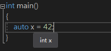

# 查看推断类型的方法

最简单直接的方法是在 IDE 中将鼠标停放在变量上：



利用报错信息，比如写一个声明但不定义的类模板，用这个模板创建实例时将出错，编译将提示错误原因。

```
template<typename T>
class A;

A<decltype(x)> xType; //@ 未定义类模板，错误信息将提示x类型
//@ 比如对 int x 报错如下
error C2079: “xType”使用未定义的 class“A<int>”
```

使用 [type_id](https://en.cppreference.com/w/cpp/language/typeid) 运算符和 [std::type_info::name](https://en.cppreference.com/w/cpp/types/type_info/name) 获取类型，但得到的类型会忽略 `cv` 和引用限定符：

```
template<typename T>
void f(T& x)
{
    std::cout << "T = " << typeid(T).name() << '\n';
    std::cout << "x = " << typeid(x).name() << '\n';
}
```

使用 [Boost.TypeIndex](https://www.boost.org/doc/libs/1_71_0/doc/html/boost_typeindex_header_reference.html#header.boost.type_index_hpp) 可以得到精确类型：

```
#include <boost/type_index.hpp>

template<typename T>
void f(const T& x)
{
    using boost::typeindex::type_id_with_cvr;
    std::cout << "T = " << type_id_with_cvr<T>().pretty_name() << '\n';
    std::cout << "x = " << type_id_with_cvr<decltype(x)>().pretty_name() << '\n';
}
```

